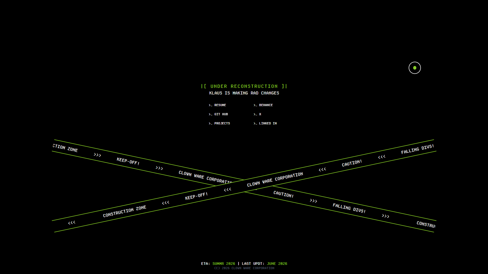

# Klaus117 — Personal Portfolio

> A terminal-booting, 3D-powered personal site — built to show what I can build, not just tell you about it.

[](https://nextjs.org)
[](https://react.dev)
[](https://www.typescriptlang.org)
[](https://tailwindcss.com)
[](https://threejs.org)

**🔗 Live site:** [klaus117-v1.vercel.app](https://klaus117-v1.vercel.app/)



---

## What is this?

This is my personal developer portfolio, and a live sandbox for the front-end techniques I'm actively building skill in. Rather than a static "About Me" page, visitors get:

- A fake BIOS/terminal **boot sequence** on load, which redirects into the actual site
- An **interactive 3D model** (a Destiny Ghost) that tracks the cursor, rendered with `react-three-fiber`
- A **custom animated cursor** system
- A retro terminal / DOS aesthetic with multiple switchable **theme variants**

The whole site leans into a playful sci-fi / retro-computing persona rather than a corporate portfolio template — the code itself is the demo.

## Highlights

- 🖥️ Custom typewriter-driven boot sequence with an ASCII progress bar, powered by a hand-rolled typewriter hook
- 🎮 Real-time 3D rendering with `react-three-fiber` + `drei` — GLTF model loading, pointer-tracked rotation
- 🖱️ Custom dual-ring cursor with hover/click states, built with `motion`
- 🎨 CSS-variable-driven theming (Tailwind v4, `oklch()` colors) switchable via `next-themes`
- 🧩 Hand-picked Radix UI primitives — no bloated component library, just what's needed
- 🔊 Background music player, DOS-styled links, and a custom marquee — all built from scratch

---

## Architecture

```
┌──────────────────────────────────────────────────────────┐
│  Root Layout  (src/app/layout.tsx)                        │
│  - Local fonts (Helvetica Neue, Geist, Departure Mono)     │
│  - ThemeProvider (default / dark / retro / terminal)       │
│  - Presence easter egg (console.log signature)             │
└──────────────────────────────────────────────────────────┘
                          │
        ┌─────────────────┴─────────────────┐
        ▼                                     ▼
┌───────────────────┐              ┌───────────────────────────┐
│  /  (page.tsx)     │              │  (main) layout             │
│  StartupScreen —   │  redirects   │  - Custom Cursor            │
│  terminal boot      │ ──────────▶ │  - MainHeader               │
│  sequence            │              └───────────────────────────┘
└───────────────────┘                          │
                          ┌─────────────────────┼─────────────────────┐
                          ▼                     ▼                     ▼
                 ┌────────────────┐  ┌───────────────────┐  ┌──────────────────┐
                 │  /117           │  │  /projects          │  │  /arcade           │
                 │  Hero · Projects│  │  Project showcase   │  │  "KLAUSLANDIA"     │
                 │  · Contact      │  │  (in progress)      │  │  concept (in       │
                 │  · MainFooter   │  │                      │  │  progress)         │
                 └────────────────┘  └───────────────────┘  └──────────────────┘
```

Route groups keep the boot experience (`/`) separate from the persistent chrome shared by every other page (`(main)` layout — cursor + header), so the terminal intro can stay lightweight while the rest of the site shares providers and layout.

## Project Structure

```
src/
├── app/
│   ├── layout.tsx               # root layout: fonts, ThemeProvider
│   ├── page.tsx                 # boot sequence, redirects to /117
│   ├── not-found.tsx
│   └── (main)/
│       ├── layout.tsx           # cursor + header shared across main routes
│       ├── 117/
│       │   ├── page.tsx         # main landing page
│       │   └── sections/        # hero, projects, contact, project-item
│       ├── projects/            # dedicated project showcase (in progress)
│       └── arcade/              # retro arcade concept (in progress)
├── components/
│   ├── 3d/                      # react-three-fiber Destiny Ghost model
│   ├── cursor.tsx               # custom animated cursor
│   ├── music-player.tsx         # background audio player
│   ├── layout/                  # headers, footers, terminal chrome
│   ├── loaders/                 # boot & loading screens
│   ├── eggs/                    # easter eggs
│   └── ui/                      # Radix-based UI primitives
├── hooks/                       # use-clock, use-typewriter, etc.
└── lib/                         # cn() helper, text-replacer
```

## Tech Stack

| Layer | Tools |
|---|---|
| Framework | Next.js 16 (App Router, Turbopack) · React 19 · TypeScript |
| 3D | Three.js · React Three Fiber · drei |
| Animation | `motion` |
| Styling | Tailwind CSS v4 (CSS-based config, `oklch()` tokens) · tailwindcss-animate |
| UI Primitives | Radix UI · class-variance-authority |
| Theming | next-themes (default / dark / retro / terminal) |
| Icons | lucide-react |

## Core Features

### Boot Sequence (`components/loaders/startup-screen.tsx`)
A fake BIOS/terminal intro — typewriter-animated log lines and an ASCII progress bar, driven by a custom `use-typewriter` hook — that redirects into `/117` once "boot" completes.

### 3D Core (`components/3d/core.tsx`)
A `react-three-fiber` `Canvas` loading a `.glb` Destiny Ghost model via drei's `useGLTF`, with pointer position lerped into the model's rotation so it appears to track the cursor.

### Custom Cursor (`components/cursor.tsx`)
A dual-circle cursor (inner dot + outer follower ring) built with `motion`, using `mix-blend-mode: difference` and hover/mousedown state to react to interactive elements — the native cursor is disabled site-wide.

### Theming
Four theme variants (default light/dark, `.retro-theme`, `.terminal`) are defined entirely in CSS via `@theme inline` custom properties in `globals.css`, switched at runtime with `next-themes` — no `tailwind.config` file, per Tailwind v4's CSS-first config model.

---

## Status

This site is **actively under construction** — that's part of the concept, not an accident. A few pieces (the header's 3D model, marquee banners, music player) are built but currently disabled while I iterate on them.

| Route | Description | Status |
|---|---|---|
| `/` | Boot sequence, redirects to `/117` | ✅ |
| `/117` | Main landing page — hero, projects, contact | ✅ |
| `/projects` | Dedicated project showcase | 🚧 In progress |
| `/arcade` | Retro game-arcade concept page | 🚧 In progress |

## Getting Started

```bash
git clone https://github.com/klaus-xy/KLAUS117-PORTFOLIO.git
cd KLAUS117-PORTFOLIO
npm install
npm run dev
```

Open [http://localhost:3000](http://localhost:3000).

```bash
npm run build   # production build
npm start       # serve production build
npm run lint    # lint
```

## Connect

- **GitHub:** [github.com/klaus-xy](https://github.com/klaus-xy)
- **LinkedIn:** [linkedin.com/in/ayobami-oyesiku](https://www.linkedin.com/in/ayobami-oyesiku)
- **X:** [@0xKlaus117](https://x.com/0xKlaus117)
- **Behance:** [behance.net/ayobamioyesiku](https://www.behance.net/ayobamioyesiku)
- **Contra:** [contra.com/ayobami_oyesiku](https://contra.com/ayobami_oyesiku_w25bnpsu/work)
